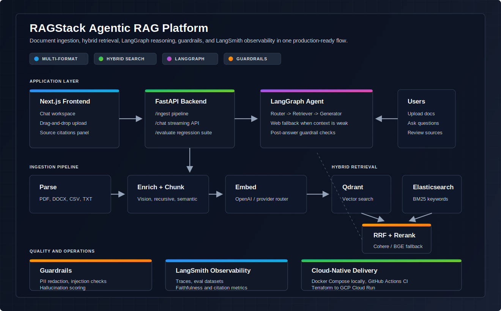
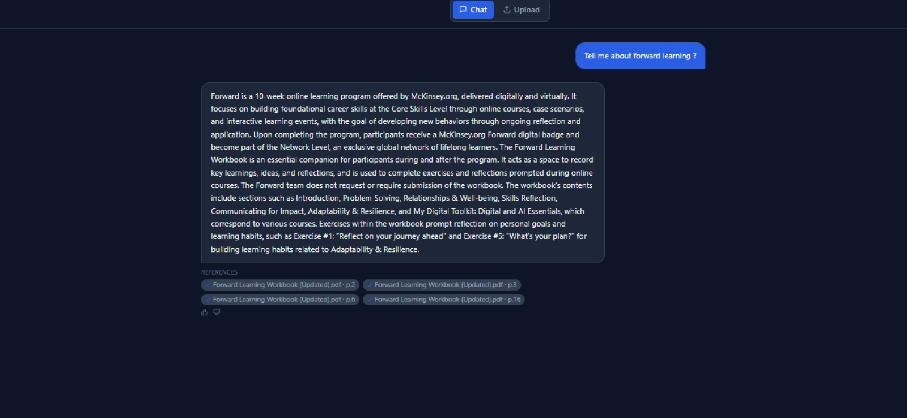

# RAGStack — Agentic RAG Platform

> Production RAG platform: multi-modal ingestion, hybrid search with reranking, a LangGraph agent, provider-configurable LLM routing (Google Gemini / OpenAI / Cohere), LangSmith observability, guardrails, API-key auth, and GCP Cloud Run deployment.

[](https://github.com/laksh344/Ragstack/actions/workflows/ci.yml)
[](https://github.com/laksh344/Ragstack/actions/workflows/ci.yml)
[](https://python.org)
[](https://langchain.com)
[](LICENSE)

---

## Architecture



---

## Demo

<a href="docs/assets/ragstack-demo.mp4">
  
</a>

[Watch the 97-second MP4 demo](docs/assets/ragstack-demo.mp4)

**What you'll see:** `0:00` upload a PDF · `~0:30` parse → chunk → embed → index into Qdrant + Elasticsearch · `~0:50` an agentic chat answer with page-level citations.

---

## Features

- **Multi-modal ingestion** — PDF (PyMuPDF + table detection), DOCX, CSV/XLSX, TXT; optional vision extraction (GPT-4o) for tables/images when running the OpenAI provider
- **Provider-configurable LLM routing** — swap chat + embedding backends between **Google Gemini (default)**, OpenAI, and Cohere with a single env var, behind one `get_llm()` / `get_embeddings()` factory
- **Hybrid search** — Qdrant vector search + Elasticsearch BM25, fused with Reciprocal Rank Fusion (RRF)
- **Cross-encoder reranking** — Cohere Rerank v3 with graceful fallback to RRF
- **LangGraph agent** — intent router, KB retriever, Tavily web-search fallback, structured-output generator, guardrails node
- **Streaming chat** — SSE token-by-token responses with page-level citations and Redis-backed multi-turn history (24h TTL)
- **Guardrails** — Presidio PII **redacted from the query before it reaches the LLM** (not just responses), prompt-injection blocked pre-generation, hallucination grounding checks, token-budget cost tracking
- **Production security** — opt-in API-key auth with per-user conversation isolation, CORS allowlist, path-traversal-safe uploads with streamed size limits
- **LangSmith observability** — every pipeline step traced; four custom evaluators (faithfulness, answer/retrieval relevance, citation accuracy)
- **Evaluation harness** — 20 hand-crafted golden QA pairs; CLI runner with A/B comparison between configs
- **Production deployment** — multi-stage Dockerfile, GCP Cloud Run, Terraform IaC, GitHub Actions CI

---

## Quick Start

```bash
# 1. Clone and configure
git clone https://github.com/laksh344/Ragstack.git && cd Ragstack
cp .env.example .env          # add GOOGLE_API_KEY (default provider) + LANGCHAIN_API_KEY, etc.

# 2. Start infrastructure (Qdrant, Elasticsearch, Redis)
make docker-up

# 3. Start backend
make dev                      # → http://localhost:8000
                              # → http://localhost:8000/docs (Swagger UI)

# 4. Start frontend (separate terminal)
cd frontend && npm install && npm run dev   # → http://localhost:3000
```

> **Minimum required:** `GOOGLE_API_KEY` (the default provider). Switch backends with `LLM_PROVIDER` / `EMBEDDING_PROVIDER` = `google` | `openai` | `cohere`. Cohere, Tavily, and LangSmith keys are optional — each degrades gracefully if absent.

---

## Tech Stack

| Layer | Technology |
|---|---|
| LLM Orchestration | LangChain + LangGraph |
| LLM & Embeddings | Google Gemini (default) · OpenAI · Cohere — provider-configurable |
| Observability | LangSmith |
| Vector DB | Qdrant |
| Keyword Search | Elasticsearch (BM25) |
| Reranker | Cohere Rerank v3 |
| Backend | FastAPI (Python 3.12) + uvicorn |
| Frontend | Next.js 16 + Tailwind CSS |
| Document Parsing | PyMuPDF + python-docx + pandas |
| PII Detection | Microsoft Presidio (+ regex fallback) |
| Web Search | Tavily |
| Cache / Sessions | Redis |
| Infra | Docker Compose → GCP Cloud Run |
| IaC | Terraform |
| CI/CD | GitHub Actions |

---

## API Reference

| Method | Endpoint | Description |
|---|---|---|
| `POST` | `/api/v1/ingest` | Upload & process a document |
| `GET` | `/api/v1/ingest/stats` | Vector + keyword store stats |
| `DELETE` | `/api/v1/ingest/{file}` | Remove all chunks for a document |
| `POST` | `/api/v1/chat` | SSE streaming chat with agent |
| `POST` | `/api/v1/chat/feedback` | Submit thumbs-up/down on a message |
| `GET` | `/api/v1/chat/{id}` | Retrieve conversation history |
| `POST` | `/api/v1/evaluate` | Run golden-QA evaluation suite |
| `GET` | `/api/v1/evaluate/results` | List stored eval run summaries |
| `GET` | `/api/v1/health` | Health check |

Full OpenAPI docs at `/docs` when the server is running.

---

## Evaluation

RAGStack treats evaluation as a first-class part of the pipeline, not an afterthought. Four custom evaluators score every answer against a 20-item, hand-built golden dataset:

| Evaluator | What it measures |
|---|---|
| **Faithfulness** | Is the answer grounded in the retrieved context? |
| **Answer Relevance** | Does the answer actually address the question? |
| **Retrieval Relevance** | Are the retrieved chunks on-topic for the query? |
| **Citation Accuracy** | Do the cited sources map to real retrieved chunks? |

Each evaluator runs in two modes: a **deterministic word-overlap mode** for fast CI checks (no API calls), and an **LLM-as-judge mode** for high-fidelity scoring. `compare.py` produces side-by-side A/B diffs between configurations — recursive vs semantic chunking, reranker on/off — which is the "I A/B-test my RAG pipeline" story behind the design.

```bash
make eval                                    # full suite (LLM-as-judge)
python eval/run_eval.py --subset 5 --no-llm  # fast, deterministic smoke test
python eval/compare.py run_a.json run_b.json --by-category --by-difficulty
```

> **Sample output** (illustrative targets — recursive chunking + Cohere rerank): faithfulness ≈ 0.84, answer relevance ≈ 0.79, retrieval relevance ≈ 0.81, citation accuracy ≈ 0.91. These are reference targets for the methodology — run `make eval` to produce live, timestamped numbers on your own corpus.

---

## System Design

### Chunking

Two strategies configurable per-upload:
- **Recursive** (default) — `RecursiveCharacterTextSplitter`, 1000 chars / 200 overlap. Fast, predictable. Best for structured docs.
- **Semantic** — `SemanticChunker` splits at embedding-similarity boundaries. Better recall for long-form prose, 3× slower.

### Hybrid Search + RRF

`VectorStore.search()` (Qdrant cosine) + `KeywordStore.search()` (ES BM25 multi-match on `content` + `title^2`) → merged by Reciprocal Rank Fusion (`score = Σ 1/(k+rank)`, k=60). No tuning needed; RRF is robust across domains.

### LangGraph Agent

```
START → router → knowledge_base → retriever → [≥threshold] → generator → guardrails → END
                                            → [<threshold] → web_search ↗
              → web_search ──────────────────────────────→ generator → guardrails → END
              → clarify/chitchat ────────────────────────→ generator → guardrails → END
```

Max 3 iterations guard; structured LLM output at every decision point; full LangSmith trace.

### Guardrails

1. **Input** — prompt-injection patterns blocked **before** generation (the agent never sees a flagged query); toxic-keyword + length checks
2. **PII** — Microsoft Presidio (`en_core_web_lg`) with regex fallback; the query is **redacted before it reaches the LLM or embeddings**, and responses are scrubbed too (email, phone, SSN, credit card)
3. **Hallucination** — word-overlap grounding by default (deterministic, no extra LLM call); optional batched LLM-as-judge; flags answers below the grounding threshold (0.3)
4. **Token budget** — tiktoken counting with per-model pricing, logged to LangSmith metadata

### Security

Designed for an internet-facing deployment, not just localhost:

- **Opt-in API-key auth** — every data/compute endpoint is gated by a `require_auth` dependency, enabled by setting `API_KEYS` (local dev stays open and frictionless). Each key maps to a stable, opaque user id.
- **Per-user isolation** — conversations are namespaced by user in Redis, so one user can never read another's history (closes an IDOR).
- **Safe uploads** — filenames are sanitized against path traversal and the body is size-capped **while streaming**, so an oversized upload is rejected before it can fill the disk.
- **CORS allowlist** — explicit origins from config; never `*`-with-credentials.
- **Secrets** — environment-only locally, GCP Secret Manager in production; `/health` never echoes connection credentials.

---

## Running Evaluations

```bash
# Run full eval suite and save JSON results
python eval/run_eval.py

# Compare two configurations (e.g. chunking strategies)
python eval/compare.py eval/results/run_a.json eval/results/run_b.json \
  --by-category --by-difficulty
```

LangSmith dataset management:
```python
from backend.observability.datasets import push_to_langsmith
push_to_langsmith()   # uploads golden_qa.json to LangSmith
```

---

## Deployment

### Docker (local)
```bash
docker build -t ragstack .
docker compose -f docker-compose.prod.yml up -d
```

### GCP Cloud Run (production)
```bash
cd terraform
terraform init
terraform apply \
  -var="project_id=YOUR_GCP_PROJECT" \
  -var="image=gcr.io/YOUR_PROJECT/ragstack:latest" \
  -var="openai_api_key=$OPENAI_API_KEY" \
  -var="langchain_api_key=$LANGCHAIN_API_KEY"
```

CI (lint + type-check + 156 tests) runs on every push/PR. Deployment is a **manual GitHub Action** (`workflow_dispatch`) that builds the image and ships to Cloud Run once the GCP secrets are configured — see [`.github/workflows/deploy.yml`](.github/workflows/deploy.yml).

---

## Project Structure

```
ragstack/
├── backend/
│   ├── api/           # FastAPI routes (ingest, chat, evaluate)
│   ├── ingestion/     # Parser → Chunker → Embedder pipeline
│   ├── retrieval/     # VectorStore, KeywordStore, Hybrid, Reranker
│   ├── agent/         # LangGraph graph + 5 nodes + state
│   ├── guardrails/    # PII, hallucination, input validation, token budget
│   └── observability/ # LangSmith tracing + evaluators + datasets
├── frontend/          # Next.js 16 + Tailwind — chat UI, upload, light/dark theme
├── eval/              # CLI runner + A/B comparison + golden QA dataset
├── terraform/         # GCP Cloud Run IaC
├── tests/             # 156 unit tests (zero external services required)
└── docs/              # Architecture, design decisions, demo script
```

---

## Design Decisions

See [docs/DESIGN_DECISIONS.md](docs/DESIGN_DECISIONS.md) for the full rationale behind every architectural choice — ideal for technical interview prep.

---

## Built With

- [LangChain](https://langchain.com) — Certified ×3 (LangChain, LangGraph, LangSmith)
- [LangGraph](https://langchain-ai.github.io/langgraph/) — Agent state machine
- [LangSmith](https://smith.langchain.com) — Observability and evaluation
- [Google Gemini](https://ai.google.dev/) / [OpenAI](https://openai.com) / [Cohere](https://cohere.com) — provider-configurable LLM + embeddings + reranking
- [Qdrant](https://qdrant.tech) — Vector database
- [Microsoft Presidio](https://microsoft.github.io/presidio/) — PII detection

---

## License

Apache 2.0 — see [LICENSE](LICENSE).
